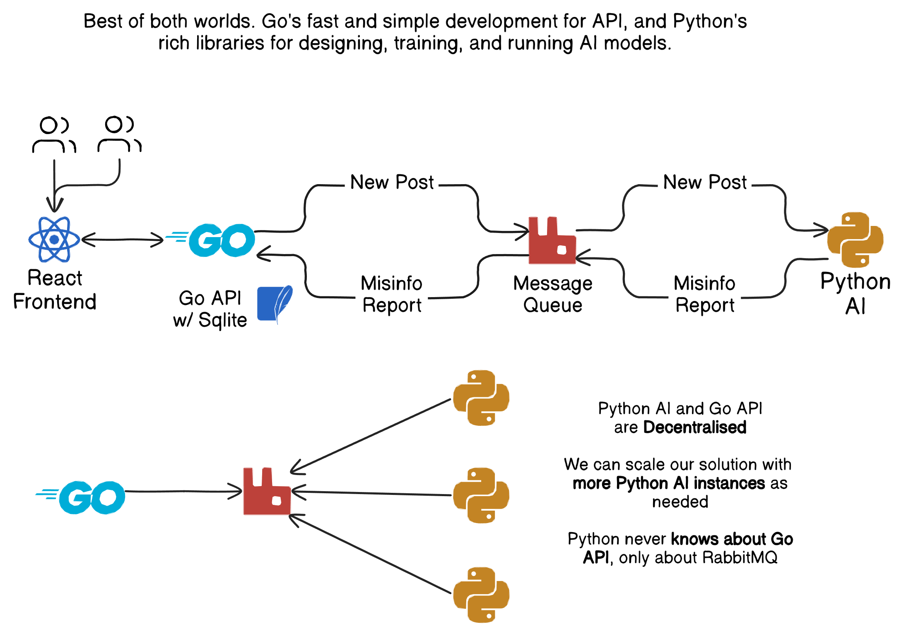

# Misinfo Detector

This repository is contains the main docker compose scripts use to deploy the misinfo detector project. It includes the frontend, backend, RabbitMQ, and the AI runner via Git submodules.

In the future, we would have GitHub actions on each of the submodules which build, and push docker images to some kind of registry (like Docker Hub, or our own AWS ECR (elastic container registry)), and simply re-pull new images. However, due to time constraints, its easier to do it this way.

## Introduction

Please read up on the READMEs for each of the repositories to understand how to properly set everything up.

 - [pymisinfo](https://github.com/PAR4LLX/pymisinfo) - The AI Runner
 - [misinfodetector-frontend](https://github.com/jedsaxon/misinfodetector-frontend) - The React frontend
 - [misinfodetector-backend](https://github.com/jedsaxon/misinfodetector-backend) - The Go API

## System Architecture



## Running

The recomended way to run bulid and run all of these services locally. However, it can take quite a while to set everything up, so this repository was made to wrap everything in a **podman compose script**.

1. Copy example environment variables

   ```bash
   cp misinfodetector-frontend/.env.example .env.frontend
   cp misinfodetector-backend/.env.example .env.backend
   ```

   By default, the containers will assume services are running on `localhost`. In a podman-based environment, you'll need to modify the environment variables to point to the correct hosts. 

2. Build all of the images using Podman (or Docker)
  
   ```bash
   podman compose build # or docker
   ```

3. Run

   ```bash
   podman compose up
   ```
